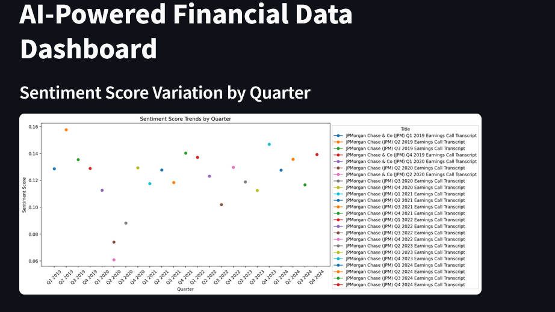
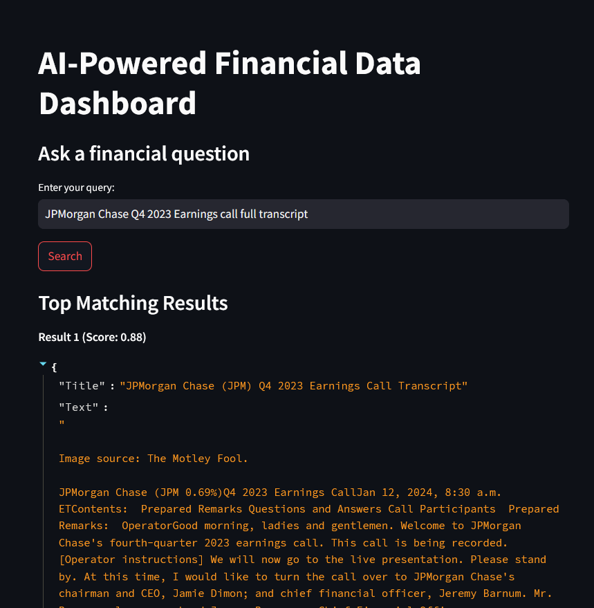

# 🚀 FinSight: AI-Powered Financial Insights  

**FinSight** is a data-driven financial analysis platform that scrapes earnings call transcripts of **JPMorgan Chase**, performs **sentiment analysis**, indexes data for **vector search**, and visualizes insights using a **Streamlit dashboard**. The pipeline is automated via **Apache Airflow DAGs** for seamless workflow management.  

## 📌 Features  

- **Automated Data Scraping**: Extracts **earnings call transcripts** of JPMorgan Chase from Motley Fool, through reverse engineered API.  
- **Sentiment Analysis**: Evaluates the tone of earnings calls using NLP techniques.  
- **Vector Search**: Enables semantic search over transcripts using embeddings.  
- **Streamlit Dashboard**: Interactive UI for exploring trends, sentiment scores, and insights.  
- **Apache Airflow DAGs**: Manages data ingestion, processing, and indexing efficiently.  

## 🏗️ Tech Stack  

- **Python** (Data processing, ML, API development)  
- **BeautifulSoup/Selenium** (Scraping Data)   
- **FinBERT LLM** (Sentiment analysis)  
- **Qdrant** (Vector search for transcript queries)    
- **Apache Airflow** (Orchestrating the ETL pipeline)  
- **Streamlit** (Visualizing financial insights)  

## 🔧 Installation  

1. **Clone the Repository**  
   ```sh
   git clone https://github.com/kaushal07wick/FinSight  
   cd finsight
   ```  
   
2. **Set Up a Virtual Environment**  
   ```sh
   conda create -n finsight python=3.12  
   conda activate finsight  
   ```  

3. **Install Dependencies**  
   ```sh
   pip install -r requirements.txt  
   ```  
   or 
   ```sh
   python setup.py
   ```

4. **Launch the Streamlit Dashboard**  
   ```sh
   streamlit run app.py  
   ```  

5. **Optional : Airflow DAG can run everyday or every 3 months (earnings call publishing schedule)

## 📊 How It Works  

1. **Airflow DAG** triggers the scraping of earnings call transcripts.  
2. **Sentiment analysis** runs on the scraped text to extract financial sentiment.  
3. **Vector embeddings** are created and stored in FAISS for fast retrieval.  
4. **Streamlit Dashboard** visualizes the data, allowing users to explore sentiment trends, earnings call summaries, and search past transcripts.  

## 📷 Screenshots  

| **Sentiment Analysis** | **Vector Search Results** |  
|------------------------|--------------------------|  
|  |  |  

## 🛠️ Roadmap  

- [ ] Integrate **real-time stock price correlation**  
- [ ] Deploy **on cloud with CI/CD pipelines**  

## 📝 License  

This project is licensed under the **MIT License**.  
